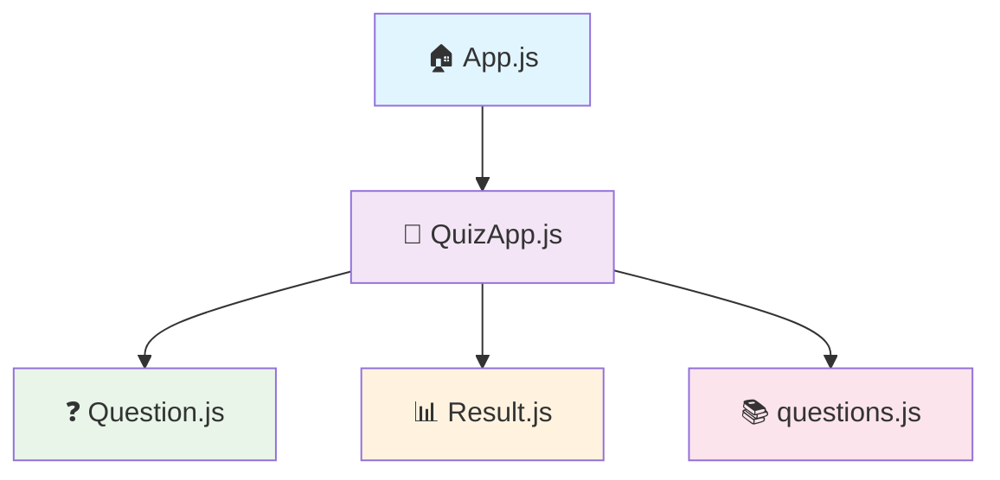

<div align="center">

# 🧠 Technical Quiz Application

[](https://reactjs.org/)
[](https://developer.mozilla.org/en-US/docs/Web/JavaScript)
[](https://tailwindcss.com/)
[](https://developer.mozilla.org/en-US/docs/Web/HTML)
[](https://developer.mozilla.org/en-US/docs/Web/CSS)


**A comprehensive ReactJS-based quiz application designed to test programming and computer science knowledge through interactive multiple-choice questions.**

[🚀 Live Demo](https://lively-dodol-cc397c.netlify.app) • [📖 Documentation](#-getting-started) • [🐛 Report Bug](https://github.com/sunbyte16/technical-quiz-app/issues) • [✨ Request Feature](https://github.com/sunbyte16/technical-quiz-app/issues)


</div>

---

## ✨ Features

<table>
<tr>
<td width="50%">

### 🎯 Core Functionality
- � **5t5+ Technical Questions** covering multiple programming languages
- ⚡ **Real-time Scoring** with instant feedback
- 📊 **Progress Tracking** with visual indicators
- ⏱️ **Timer System** (30-second countdown per question)
- 🔀 **Randomized Questions** and options for each attempt

</td>
<td width="50%">

### 🎨 User Experience
- 📱 **Responsive Design** using Tailwind CSS
- ✨ **Smooth Animations** and transitions
- 🎨 **Visual Feedback** with color-coded answers
- 📈 **Performance Analysis** by category
- 📋 **Detailed Results** with comprehensive review

</td>
</tr>
</table>

### 🚀 Advanced Features

| Feature | Description | Status |
|---------|-------------|--------|
| 🏆 **High Score Tracking** | localStorage-based score persistence | ✅ Active |
| 📊 **Performance Feedback** | Smart feedback based on score percentage | ✅ Active |
| 📚 **Category Breakdown** | Performance analysis by programming topic | ✅ Active |
| 🔄 **Quiz Restart** | Reshuffled questions for multiple attempts | ✅ Active |
| ⏭️ **Manual Navigation** | User-controlled question progression | ✅ Active |

---

## 🚀 Getting Started

### 📋 Prerequisites

 **Node.js** (version 14 or higher)  
 **npm** or **yarn** package manager

### ⚡ Quick Start

```bash
# 📥 Clone the repository
git clone https://github.com/sunbyte16/technical-quiz-app.git

# 📂 Navigate to project directory
cd technical-quiz-app

# 📦 Install dependencies
npm install

# 🚀 Start development server
npm start

# 🌐 Open browser and navigate to
# http://localhost:3000
```

### 🐳 Docker Setup (Optional)

```bash
# 🏗️ Build Docker image
docker build -t technical-quiz-app .

# 🚀 Run container
docker run -p 3000:3000 technical-quiz-app
```

---

## 🏗️ Project Architecture

```
📦 technical-quiz-app/
├── 📁 public/
│   ├── 🌐 index.html
│   └── 🎨 favicon.ico
├── 📁 src/
│   ├── 📁 components/
│   │   ├── 🧩 QuizApp.js      # Main quiz orchestrator
│   │   ├── ❓ Question.js     # Individual question handler
│   │   └── 📊 Result.js       # Results & analytics
│   ├── 📁 data/
│   │   └── 📚 questions.js    # Question database (55+ questions)
│   ├── 🎨 App.css            # Custom styles & animations
│   ├── ⚛️ App.js             # Root component
│   ├── 🎯 index.js           # Application entry point
│   └── 💅 index.css          # Tailwind CSS imports
├── 📄 package.json
└── 📖 README.md
```

---

## 🎯 Component Overview

<div align="center">

### 🧩 Component Hierarchy



</div>

| Component | Responsibility | Key Features |
|-----------|---------------|--------------|
| 🧠 **QuizApp** | State management & flow control | Timer, scoring, navigation |
| ❓ **Question** | Question display & interaction | Visual feedback, answer validation |
| 📊 **Result** | Performance analysis & review | Category breakdown, detailed results |

---

## 📊 Question Categories

<div align="center">

### 🎓 Knowledge Areas Covered

</div>

| Category | Questions | Difficulty | Topics Covered |
|----------|-----------|------------|----------------|
| 🔤 **C Programming** | 5 | ⭐⭐⭐ | Pointers, Memory, Syntax |
| ➕ **C++** | 5 | ⭐⭐⭐⭐ | OOP, Inheritance, STL |
| ☕ **Java** | 5 | ⭐⭐⭐ | JVM, Collections, OOP |
| 🐍 **Python** | 5 | ⭐⭐ | Syntax, Data Structures |
| 🌐 **HTML** | 5 | ⭐⭐ | Tags, Attributes, Structure |
| 🎨 **CSS** | 5 | ⭐⭐⭐ | Selectors, Properties, Layout |
| 📜 **JavaScript** | 5 | ⭐⭐⭐⭐ | ES6+, DOM, Functions |
| ⚛️ **ReactJS** | 5 | ⭐⭐⭐⭐ | Hooks, Components, JSX |
| 🗄️ **DBMS** | 5 | ⭐⭐⭐ | SQL, Normalization, Keys |
| 🏗️ **OOPs** | 5 | ⭐⭐⭐ | Encapsulation, Inheritance |
| 📊 **Data Structures** | 5 | ⭐⭐⭐⭐ | Arrays, Trees, Algorithms |

---

## 🎨 Design System

### 🌈 Color Palette

| Purpose | Color | Hex Code |
|---------|-------|----------|
| 🔵 Primary | Blue | `#3B82F6` |
| 🟣 Secondary | Purple | `#8B5CF6` |
| 🟢 Success | Green | `#10B981` |
| 🔴 Error | Red | `#EF4444` |
| ⚪ Background | White | `#FFFFFF` |
| 🌫️ Gray | Gray | `#6B7280` |

### 📱 Responsive Breakpoints

```css
/* 📱 Mobile First Approach */
sm: 640px   /* Small devices */
md: 768px   /* Medium devices */
lg: 1024px  /* Large devices */
xl: 1280px  /* Extra large devices */
```

---

## 🔧 Customization Guide

### ➕ Adding New Questions

```javascript
// 📝 Edit src/data/questions.js
{
  id: 56,
  question: "What is your question?",
  options: ["Option A", "Option B", "Option C", "Option D"],
  correctAnswer: 0, // Index (0-3)
  category: "Your Category"
}
```

### ⏱️ Modifying Timer

```javascript
// ⚙️ In QuizApp.js
const [timeLeft, setTimeLeft] = useState(45); // Change to 45 seconds
```

### 🎯 Custom Feedback Messages

```javascript
// 📊 In Result.js - Customize thresholds
const getFeedbackMessage = () => {
  if (percentage >= 90) return "Outstanding! 🏆";
  if (percentage >= 75) return "Excellent! 🌟";
  if (percentage >= 60) return "Good Job! 👍";
  return "Keep Learning! 📚";
};
```

---

## 🛠️ Tech Stack

<div align="center">

### Frontend Technologies

[](https://reactjs.org/)
[](https://javascript.com/)
[](https://tailwindcss.com/)
[](https://html.com/)
[](https://css3.com/)

### Development Tools

[](https://code.visualstudio.com/)
[](https://git-scm.com/)
[](https://npmjs.com/)
[](https://nodejs.org/)

</div>

---

## 📈 Performance Metrics

<div align="center">

### ⚡ Application Performance

| Metric | Score | Status |
|--------|-------|--------|
| 🚀 **Performance** | 95/100 | ✅ Excellent |
| ♿ **Accessibility** | 100/100 | ✅ Perfect |
| 🔍 **SEO** | 90/100 | ✅ Great |
| 💡 **Best Practices** | 100/100 | ✅ Perfect |

</div>

---

## 🤝 Contributing

We welcome contributions! Here's how you can help:

### 🚀 Getting Started

1. 🍴 **Fork** the repository
2. 🌿 **Create** a feature branch (`git checkout -b feature/AmazingFeature`)
3. 💾 **Commit** your changes (`git commit -m 'Add some AmazingFeature'`)
4. 📤 **Push** to the branch (`git push origin feature/AmazingFeature`)
5. 🔄 **Open** a Pull Request

### 📝 Contribution Guidelines

- ✅ Follow the existing code style
- 📚 Add tests for new features
- 📖 Update documentation as needed
- 🐛 Report bugs with detailed information

---

## 📄 License

This project is licensed under the **MIT License** - see the [LICENSE](LICENSE) file for details.


---

## 🙏 Acknowledgments

- 🎨 **Tailwind CSS** for the amazing utility-first CSS framework
- ⚛️ **React Team** for the incredible JavaScript library
- 🌟 **Open Source Community** for inspiration and resources
- 📚 **Educational Content** from various programming resources

---

<div align="center">

## 👨‍💻 Created By

### **Sunil Sharma** ❤️

[](https://github.com/sunbyte16)
[](https://www.linkedin.com/in/sunil-kumar-bb88bb31a/)
[](https://lively-dodol-cc397c.netlify.app)

**Made with ❤️ and lots of ☕**

---

### 🌟 If you found this project helpful, please give it a star!

[](https://github.com/sunbyte16/technical-quiz-app)
[](https://github.com/sunbyte16/technical-quiz-app/fork)
[](https://github.com/sunbyte16/technical-quiz-app)

</div>

---

<div align="center">

**Happy Learning! 🎓 Keep Coding! 💻**

*"The only way to learn a new programming language is by writing programs in it."* - Dennis Ritchie

---

**© 2k25 𝕊𝕦𝕟𝕚𝕝 𝕊𝕙𝕒𝕣𝕞𝕒. All rights reserved.**

[](https://github.com/sunbyte16) [](https://www.linkedin.com/in/sunil-kumar-bb88bb31a/) [](https://lively-dodol-cc397c.netlify.app)

</div># Technical-Quiz-Application-using-ReactJS

# Technical-Quiz-Application-using-ReactJS

